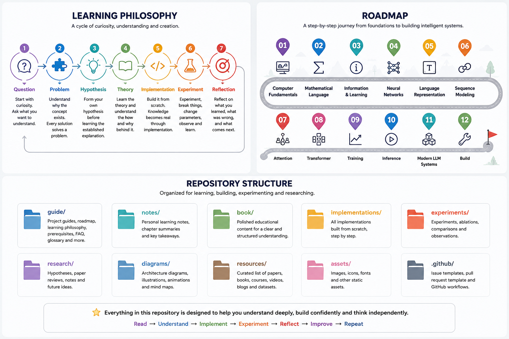

# Glossary

This glossary contains the key terms used throughout the project. Definitions are intentionally concise and beginner-friendly. As the project evolves, this glossary will continue to grow.

---

## AI (Artificial Intelligence)

A field of computer science focused on building systems that can perform tasks typically requiring human intelligence, such as reasoning, learning, language understanding, and problem-solving.

---

## Algorithm

A sequence of well-defined instructions designed to solve a specific problem.

---

## Attention

A mechanism that allows a model to focus on the most relevant parts of the input when processing information.

---

## Autoregressive Model

A model that generates one token at a time by predicting the next token based on all previously generated tokens.

---

## Backpropagation

An algorithm used during training to compute how each parameter contributed to the prediction error, allowing the model to improve.

---

## Batch

A group of training examples processed together during a single training step.

---

## Cross Entropy

A loss function commonly used to measure how different a model's predicted probability distribution is from the correct distribution.

---

## Dataset

A collection of data used to train, validate, or evaluate a machine learning model.

---

## Embedding

A learned numerical representation that captures meaningful relationships between objects such as words, images, or documents.

---

## Epoch

One complete pass through the entire training dataset.

---

## Gradient

A mathematical quantity that indicates how model parameters should change to reduce prediction error.

---

## Gradient Descent

An optimization algorithm that updates model parameters to minimize the loss function.

---

## Hidden State

The internal memory of recurrent neural networks that stores information from previous inputs.

---

## Inference

The process of using a trained model to generate predictions or responses.

---

## Instruction Tuning

A training process that teaches a language model to better follow natural language instructions.

---

## Large Language Model (LLM)

A neural network trained on massive amounts of text to understand and generate human language.

---

## Layer Normalization

A technique that stabilizes neural network training by normalizing activations within each layer.

---

## Learning Rate

A hyperparameter that controls how much model parameters change during each optimization step.

---

## Logits

The raw output scores produced by a model before they are converted into probabilities.

---

## Loss Function

A function that measures how far a model's predictions are from the correct answers.

---

## Matrix

A rectangular arrangement of numbers used to represent data and mathematical transformations.

---

## Model Parameters

The learned numerical values (weights and biases) that store the knowledge acquired during training.

---

## Multi-Head Attention

An extension of self-attention where multiple attention mechanisms learn different relationships simultaneously.

---

## Neural Network

A computational model composed of interconnected layers that learn patterns from data.

---

## One-Hot Encoding

A method of representing categorical values using binary vectors where only one position is active.

---

## Optimization

The process of improving model parameters to reduce prediction error.

---

## Parameter

A value learned during training that influences how a model makes predictions.

---

## Perceptron

The simplest form of a neural network capable of learning linear decision boundaries.

---

## Positional Encoding

Additional information that allows Transformers to understand the order of tokens in a sequence.

---

## Probability Distribution

A representation showing the likelihood of all possible outcomes.

---

## Prompt

The input provided to a language model to generate a response.

---

## Query, Key, Value (QKV)

The three learned representations used in the attention mechanism to determine which information should be attended to.

---

## RAG (Retrieval-Augmented Generation)

A technique that combines external knowledge retrieval with language model generation.

---

## Reinforcement Learning from Human Feedback (RLHF)

A training approach that aligns model behavior using human preferences and feedback.

---

## Self-Attention

An attention mechanism where each token attends to other tokens within the same sequence.

---

## Softmax

A mathematical function that converts raw scores into probabilities whose total equals one.

---

## Token

The smallest unit of text processed by a language model. A token may represent a word, subword, character, or symbol.

---

## Tokenization

The process of converting raw text into tokens that can be processed by a model.

---

## Transformer

A neural network architecture built around self-attention that serves as the foundation of modern Large Language Models.

---

## Vector

An ordered list of numbers representing information in a mathematical space.

---

## Vector Database

A database optimized for storing and searching high-dimensional vector representations.

---

## Vocabulary

The complete set of tokens recognized by a tokenizer and language model.

---

## Weight

A learned parameter that determines how strongly one neuron influences another during computation.
